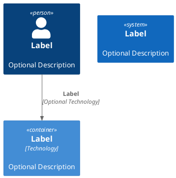

# demarches-simplifiees-docker

# Objet

L'objet de ce projet est de créer une image Docker de démarche simplifiée.

# Étapes à suivre

Créer une image contenant Ruby, Node et Yarn. Les étapes sont les suivantes :

- Aller dans le répertoiore ./ruby-node-yarn à l'aide d'un terminal
- Lancer la commande ci-dessous :

```bash
docker build -t "Ruby-3.3.0-Node-20.x-Yarn-slim-bookworm:0.1" .
```

# Modules

Deux modules sont déployables

* Une partie IHM utilisant les technologies :
  * Ruby on Rails
  * React
  * Node.js

# Aspect

Configuration par environnement



# Initialisation de la base de données

Lancer la commande ci-dessous en ruby dans le cas où la base de données n'a jamais été initialisée

```bash
rails db:reset
```