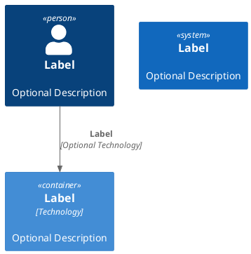

# demarches-simplifiees-docker

# Objet

L'objet de ce projet est de créer une image Docker de démarche simplifiée.

# Étapes à suivre

Créer une image contenant Ruby, Node et Yarn. Les étapes sont les suivantes :

- Aller dans le répertoiore ./ruby-node-yarn à l'aide d'un terminal
- Lancer la commande ci-dessous :

```bash
docker build -t "Ruby-3.3.0-Node-20.x-Yarn-slim-bookworm:0.1" .
```

# Modules

Deux modules sont déployables

* Une partie IHM utilisant les technologies :
  * Ruby on Rails
  * React
  * Node.js

# Aspect

Configuration par environnement



# Initialisation de la base de données

Lancer la commande ci-dessous en ruby dans le cas où la base de données n'a jamais été initialisée

```bash
rails db:reset
```

# Initialiser un compte super administrateur

- Se connecter sur l'URL : https://diplodemarches.agents.localhost/users/sign_up
- Saisir un logon/password pour initialiser le compte
- Se connecter sur l'interface de réception des mails à l'adresse : https://diplodemarches.agents.localhost:8025
- Un mail doit être présent sur l'interface.
- Ouvrir le mail et cliquer sur le lien. Votre compte est activé comme utilisateur standard.
- se connecter en ligne de commande sur le container batch :

```bash
docker compose exec batch bash
```

- Exécuter l'ajout d'un compte d'administrateur à l'aide de la commande ci-dessous

```bash
bundler exec bin/rails superadmin:create[adresse-mail@test.com]
```

- Un mail de changement de mot de passe est envoyé afin d'initialiser le TOTP.
- Suivre le lien du mail.